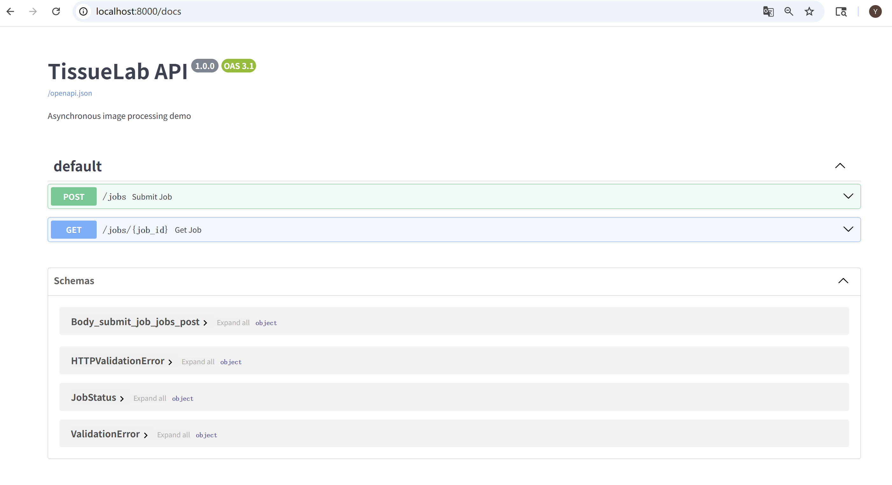
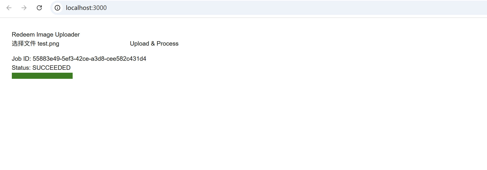

## 运行截图



## 如何扩展至 10× 用户
- 文件存 S3 + 预签名 URL 直传，后端只负责任务调度  
- Celery + Redis 队列横向扩容 worker 容器  
- viewer 静态部署到 Vercel/CloudFront，边缘缓存  

## 测试与监控
- 单元：pytest 覆盖 `/jobs` API；jest 测试前端组件  
- E2E：Playwright 脚本上传 DICOM → 断言进度条 100%  
- 生产：Prometheus `/metrics` + Grafana 看板，任务失败率 >5% 报警  

## Screenshots


## Scaling to 10× Users
- Store files in S3 with pre-signed URLs; backend only schedules tasks  
- Horizontally scale Celery workers with Redis queue  
- Deploy viewer to Vercel/CloudFront for edge caching  

## Testing & Monitoring
- Unit: pytest for `/jobs` API; jest for React components  
- E2E: Playwright script uploads DICOM and asserts 100% progress  
- Prod: Prometheus `/metrics` + Grafana dashboard; alert if failure rate >5%  

## 30s Demo Video
[Watch on Loom](https://www.loom.com/share/f051cfbbc0a248fabce75ac4b880532f?sid=9ef644eb-9d55-4ae7-9e53-6688ae75702c)

## Current Status & Known Issues
| Item | Status |
| Multi-window upload / viewer | ✅ Complete and demo-ready |
| Sidebar UI (TissueLab style) | ✅ Complete |
| Local development | ⚠️ Requires Node 20 LTS (Node 22 triggers Next.js internal 500) |
| Remote demo | ✅ Pushed and browsable |

## Quick Try (no local install needed)
1. Browse the source: [GitHub Repository](https://github.com/yt2895-beep/upenn-tissue-lab   )  
2. Download ZIP → extract → follow the steps below to run locally.

## Local Setup (Node 20)
```bash
nvm use 20          # or nvm-windows
npm install
npm run dev不要这么分点，帮我分段落就好了，但是描述详细一点
